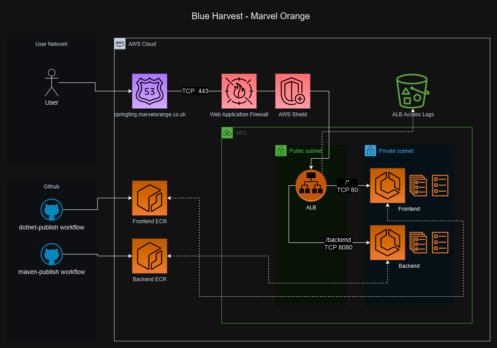

# BH Assessment App

## Deployment

1. Deploy Cloudformation stack to AWS to bootstrap the Solution `cloudformation/bootstrap.yaml`
2. Using the AWS Secrets Manager entry outputted from stack above, configure Github secrets for IAM Auth `AWS_ACCESS_KEY_ID` and `AWS_SECRET_ACCESS_KEY`
3. Ensure certificate is imported to ACM and domain name updated in the data source within `terraform/data.tf`
```
data "aws_acm_certificate" "mo_issued" {
  domain   = "*.marvelorange.co.uk"
  statuses = ["ISSUED"]
}
```
4. Run terraform-apply workflow from GitHub actions, ensure the plan is appropriate before approving deployment
5. Run the dotnet-publish workflow from GitHub actions
6. Run the maven-publish workflow from GitHub actions
7. Run the deploy-ecs workflow from GitHub actions

## Solution

The following repo creates and maintains a full stack application hosted in microservices.
Frontend (dotnet - docker)
Backend (maven - docker) 
AWS infra (terraform/cloudformation)
Github Actions (CICD)

### Design

